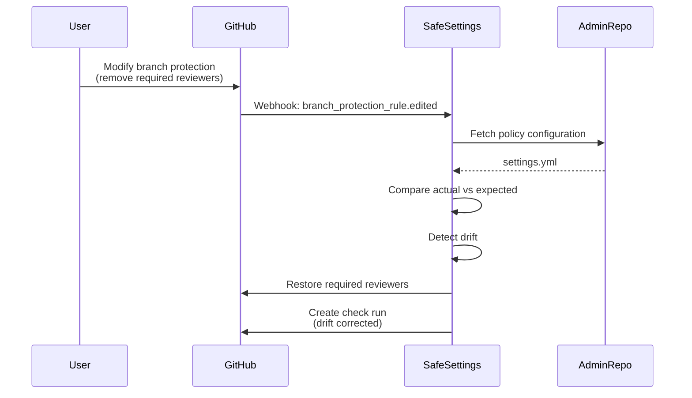
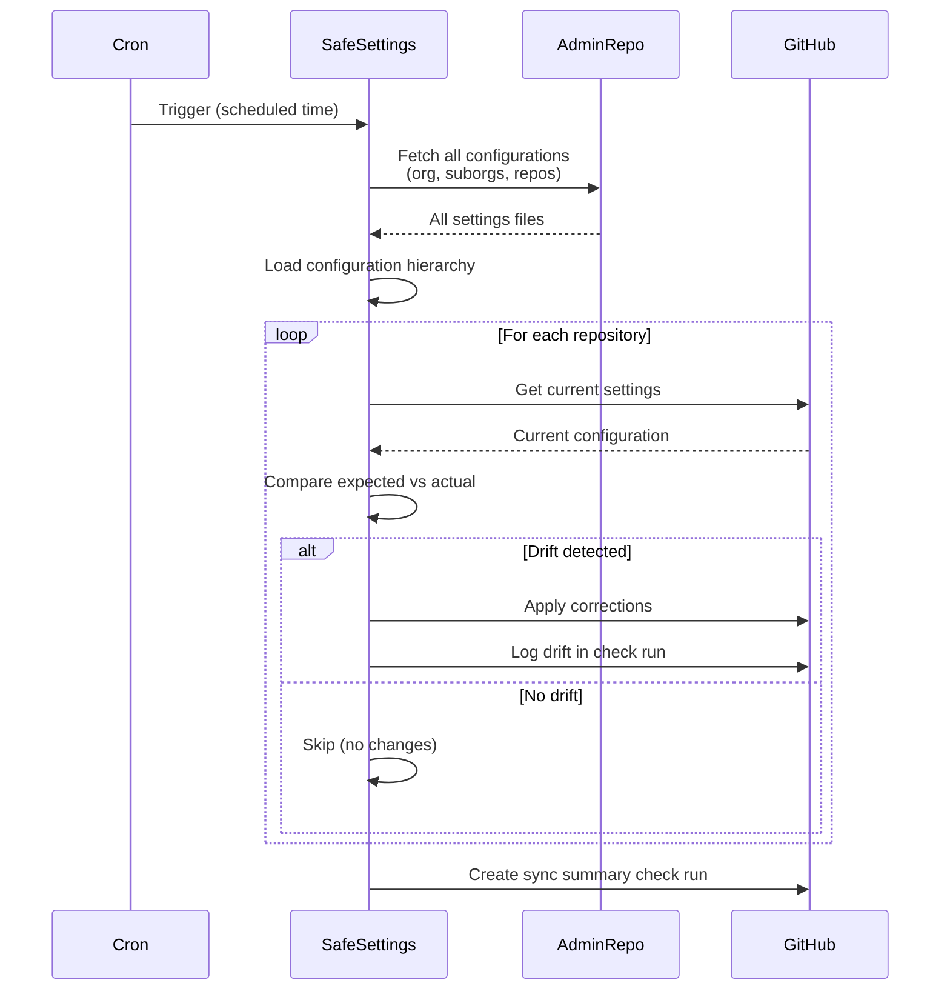

Configuration drift occurs when repository settings are modified outside of Safe Settings, causing actual configurations to diverge from your policy-as-code definitions. Safe Settings provides multiple mechanisms to prevent and correct drift.

## What is Configuration Drift?

Drift happens when:

- Users manually change settings through GitHub UI
- Automation tools modify configurations
- Branch protections are deleted or weakened
- Team permissions are altered
- Repository settings are changed

Without drift prevention, these manual changes can:
- Create security vulnerabilities
- Violate compliance policies
- Cause inconsistencies across repositories
- Undermine policy-as-code governance

## Drift Prevention Strategies

Safe Settings uses two complementary approaches:

1. **Webhook-based detection** - Immediate response to changes
2. **Scheduled synchronization** - Periodic convergence

## Webhook-Based Drift Prevention

Safe Settings listens to GitHub webhook events and automatically reverts unauthorized changes.

### Monitored Events

Safe Settings responds to these webhook events to prevent drift:

#### Branch Protection Changes

```yaml
Event: branch_protection_rule
Triggers: created, edited, deleted
```

**Example scenario**:
1. User disables "Require pull request reviews" in GitHub UI
2. Webhook fires: `branch_protection_rule.edited`
3. Safe Settings detects change doesn't match configuration
4. Automatically restores required reviews setting

#### Repository Settings Changes

```yaml
Event: repository.edited
Triggers: renamed, visibility changed, topics modified, default branch changed
```

**Example scenario**:
1. User changes repository from private to public
2. Webhook fires: `repository.edited`
3. Safe Settings compares against settings configuration
4. Reverts repository to private if configured

#### Team Permission Changes

```yaml
Events:
  - member.added
  - member.removed
  - team.added_to_repository
  - team.removed_from_repository
  - team.edited
```

**Example scenario**:
1. User manually grants team admin access to repository
2. Webhook fires: `team.added_to_repository`
3. Safe Settings checks configured permissions
4. Adjusts to configured permission level (e.g., write)

#### Ruleset Changes

```yaml
Event: repository_ruleset
Triggers: created, edited, deleted
```

**Example scenario**:
1. User modifies ruleset to remove status check requirements
2. Webhook fires: `repository_ruleset.edited`
3. Safe Settings restores status check requirements

#### Custom Property Changes

```yaml
Event: custom_property_values
Triggers: set, updated
```

**Example scenario**:
1. User sets custom property `environment=production`
2. Webhook fires: `custom_property_values`
3. Safe Settings applies suborg configuration for production repos

### How Webhook Drift Prevention Works

<CodeGroup>

</CodeGroup>

### Configuration for Webhooks

Webhook-based drift prevention is automatic. Ensure your GitHub App has these permissions:

- Repository administration: Read & write
- Repository hooks: Read & write
- Organization administration: Read & write

### Webhook Event Examples

#### Example 1: Branch Protection Drift

<CodeGroup>
```yaml .github/settings.yml (Policy)
branches:
  - name: main
    protection:
      required_pull_request_reviews:
        required_approving_review_count: 2
        dismiss_stale_reviews: true
      enforce_admins: true
```

```javascript Manual Change (UI)
// User changes required reviewers from 2 to 1
required_approving_review_count: 1  // DRIFT!
```

```yaml Safe Settings Response
1. Receives branch_protection_rule.edited webhook
2. Fetches .github/settings.yml from admin repo
3. Compares: Expected=2, Actual=1
4. Detects drift: required_approving_review_count
5. API call: Update branch protection
6. Restores required_approving_review_count to 2
7. Creates check run documenting the drift correction
```
</CodeGroup>

#### Example 2: Team Permission Drift

<CodeGroup>
```yaml .github/settings.yml (Policy)
teams:
  - name: developers
    permission: write
  - name: security-team
    permission: admin
```

```javascript Manual Change (UI)
// User grants developers admin access
team: developers
permission: admin  // DRIFT!
```

```yaml Safe Settings Response
1. Receives team.edited webhook
2. Fetches team configuration
3. Compares: Expected=write, Actual=admin
4. Detects drift: developers permission
5. API call: Update team permission
6. Restores permission to write
```
</CodeGroup>

## Scheduled Synchronization

Scheduled sync provides a safety net by periodically converging all repositories to their configured state, catching any drift that webhooks might miss.

### Why Scheduled Sync?

Webhooks aren't always guaranteed to be delivered:

- Network failures
- Webhook delivery failures
- Service outages
- GitHub webhook limits
- Missed events during maintenance

Scheduled sync ensures eventual consistency.

### Configuring Scheduled Sync

Set the `CRON` environment variable to run Safe Settings on a schedule.

<CodeGroup>
```bash .env (Every Hour)
# Run at the start of every hour
CRON=0 * * * *
```

```bash .env (Every 6 Hours)
# Run every 6 hours
CRON=0 */6 * * *
```

```bash .env (Daily at 2 AM)
# Run once per day at 2:00 AM
CRON=0 2 * * *
```

```bash .env (Every 15 Minutes)
# Run every 15 minutes (high frequency)
CRON=*/15 * * * *
```
</CodeGroup>

### Cron Syntax

Safe Settings uses [node-cron](https://www.npmjs.com/package/node-cron) syntax:

```
┌────────────── second (optional, 0-59)
│ ┌──────────── minute (0-59)
│ │ ┌────────── hour (0-23)
│ │ │ ┌──────── day of month (1-31)
│ │ │ │ ┌────── month (1-12)
│ │ │ │ │ ┌──── day of week (0-7, 0 and 7 are Sunday)
│ │ │ │ │ │
│ │ │ │ │ │
* * * * * *
```

### Common Cron Patterns

| Pattern | Description | Use Case |
|---------|-------------|----------|
| `*/5 * * * *` | Every 5 minutes | Testing, high-security |
| `0 * * * *` | Every hour | Standard production |
| `0 */2 * * *` | Every 2 hours | Balanced approach |
| `0 */6 * * *` | Every 6 hours | Light sync |
| `0 0 * * *` | Daily at midnight | Low-frequency |
| `0 2 * * *` | Daily at 2 AM | Off-peak hours |
| `0 0 * * 0` | Weekly on Sunday | Minimal sync |
| `0 9 * * 1-5` | Weekdays at 9 AM | Business hours |

### How Scheduled Sync Works

<CodeGroup>

</CodeGroup>

### Scheduled Sync Behavior

During scheduled sync:

1. **Load all configurations**: Org, suborg, and repo settings
2. **Process each repository**: Apply configuration hierarchy
3. **Detect differences**: Compare current GitHub state with expected state
4. **Apply only changes**: Only make API calls when drift is detected
5. **Create check runs**: Document sync results

### Performance Considerations

Scheduled sync is optimized for organizations with thousands of repositories:

- Only loads changed configuration files (not all files every time)
- Only makes API calls when drift is detected
- Respects rate limits automatically (via Probot)
- Completes within GitHub App token lifetime (1 hour)

See [Performance Optimization](/advanced/performance) for details.

## Comparison Logic

Both webhook and scheduled sync use intelligent comparison to detect drift.

### What Gets Compared

Safe Settings compares:

- Repository settings (visibility, features, default branch)
- Branch protection rules
- Required status checks
- Team permissions
- Collaborator permissions
- Labels
- Milestones
- Autolinks
- Environments
- Variables
- Rulesets
- Custom properties

### How Comparison Works

The `compareDeep` function generates detailed differences:

<CodeGroup>
```json Expected Configuration
{
  "branches": [{
    "name": "main",
    "protection": {
      "required_pull_request_reviews": {
        "required_approving_review_count": 2,
        "dismiss_stale_reviews": true
      },
      "enforce_admins": true
    }
  }]
}
```

```json Actual GitHub State
{
  "branches": [{
    "name": "main",
    "protection": {
      "required_pull_request_reviews": {
        "required_approving_review_count": 1,
        "dismiss_stale_reviews": true
      },
      "enforce_admins": false
    }
  }]
}
```

```json Detected Differences
{
  "additions": {},
  "modifications": {
    "branches": [{
      "name": "main",
      "protection": {
        "required_pull_request_reviews": {
          "required_approving_review_count": 2
        },
        "enforce_admins": true
      }
    }]
  },
  "deletions": {},
  "hasChanges": true
}
```
</CodeGroup>

### Smart Comparison Features

**Ignores irrelevant fields**:
```javascript
// Ignored during comparison:
- url fields (resource URLs)
- timestamps
- GitHub-generated IDs
```

**Handles different data structures**:
```javascript
// Properly compares:
- Arrays with different ordering
- Nested objects
- Case-sensitive vs case-insensitive fields
```

**Only updates when necessary**:
```javascript
if (results.hasChanges) {
  // Make API call to update
} else {
  // Skip - no actual changes
}
```

## Monitoring Drift

### Check Runs

Every drift detection and correction creates a check run in your admin repository:

```
✅ safe-settings

Sync completed for 45 repositories

Drift detected and corrected:
  - repo-api: Branch protection (required_approving_review_count)
  - repo-web: Team permissions (developers: admin → write)
  - repo-service: Repository settings (visibility: public → private)

No changes needed: 42 repositories
```

### Check Run Details

Click into check runs to see detailed changes:

```json
Repository: repo-api

Modifications:
{
  "branches": [{
    "name": "main",
    "protection": {
      "required_pull_request_reviews": {
        "required_approving_review_count": 2  // Changed from 1
      }
    }
  }]
}

API Calls Made:
  PUT /repos/org/repo-api/branches/main/protection
```

### Logging

Safe Settings logs all drift detection:

```bash
# View drift detection logs
docker logs safe-settings | grep "drift\|hasChanges"

# Example output:
[2024-03-15T10:30:45Z] INFO: Drift detected in repo-api
[2024-03-15T10:30:45Z] INFO: hasChanges: true
[2024-03-15T10:30:46Z] INFO: Applied corrections to repo-api
```

## Best Practices

### Choose Appropriate Sync Frequency

**High-security environments**:
```bash
# Sync every 30 minutes
CRON=*/30 * * * *
```

**Standard production**:
```bash
# Sync every 2-6 hours
CRON=0 */2 * * *
```

**Low-risk environments**:
```bash
# Sync daily
CRON=0 2 * * *
```

### Consider API Rate Limits

More frequent syncs consume more API quota:

- **Webhooks**: Minimal API usage (only affected repos)
- **Scheduled sync**: API calls for all repos (even without changes)

Balance security needs with API limits:

```bash
# For 1000 repos:
# Hourly sync = ~1000 API calls/hour
# Every 6 hours = ~167 API calls/hour
# Daily = ~42 API calls/hour
```

### Schedule During Off-Peak Hours

Run heavy syncs when developers are less active:

```bash
# Daily at 2 AM
CRON=0 2 * * *

# Twice daily: 2 AM and 2 PM
CRON=0 2,14 * * *
```

### Combine Both Approaches

Use webhooks for immediate response + scheduled sync as backup:

```bash
# Webhooks handle most drift immediately
# Scheduled sync catches anything webhooks missed
CRON=0 */6 * * *  # Every 6 hours
```

### Monitor Drift Patterns

Review check runs to identify:

- Frequently drifting repositories
- Common types of drift
- Users making unauthorized changes
- Gaps in your policies

Use insights to:
- Educate teams on policy
- Adjust configurations
- Identify process gaps

### Handle Legitimate Changes

If drift corrections are unwanted:

**Option 1**: Update configuration to match desired state
```yaml
# Update settings.yml to reflect new requirements
branches:
  - name: main
    protection:
      required_approving_review_count: 1  # Reduced from 2
```

**Option 2**: Use external management for specific settings
```yaml
# Allow manual management of status checks
required_status_checks:
  contexts:
    - "{{EXTERNALLY_DEFINED}}"
```

**Option 3**: Exclude specific repositories
```yaml deployment-settings.yml
restrictedRepos:
  exclude:
    - special-repo  # Manual management
```

## Troubleshooting

### Drift Not Being Corrected

**Problem**: Manual changes aren't being reverted.

**Possible causes**:

1. **Webhooks not configured**
   ```bash
   # Check GitHub App webhook configuration
   # Verify webhook events are enabled
   ```

2. **Repository is restricted**
   ```yaml
   # Check deployment-settings.yml
   restrictedRepos:
     exclude:
       - problem-repo  # This repo is excluded!
   ```

3. **Setting matches configuration**
   ```yaml
   # Manual change actually matches your config
   # Update your configuration if this is drift
   ```

### Scheduled Sync Not Running

**Problem**: Cron job doesn't seem to execute.

**Debug steps**:

1. **Verify CRON syntax**
   ```bash
   # Test on crontab.guru
   # Ensure format is correct
   ```

2. **Check environment variable**
   ```bash
   docker exec safe-settings env | grep CRON
   ```

3. **Review application logs**
   ```bash
   docker logs safe-settings | grep -i cron
   ```

4. **Verify app is running**
   ```bash
   docker ps | grep safe-settings
   ```

### Too Many API Calls

**Problem**: Hitting GitHub API rate limits.

**Solutions**:

1. **Reduce sync frequency**
   ```bash
   # Change from every hour to every 6 hours
   CRON=0 */6 * * *
   ```

2. **Use restricted repos**
   ```yaml
   # Manage fewer repositories
   restrictedRepos:
     include:
       - critical-*
   ```

3. **Monitor API usage**
   ```bash
   # Check rate limit status
   gh api rate_limit
   ```

### Unexpected Drift Corrections

**Problem**: Safe Settings is reverting legitimate changes.

**Cause**: Configuration doesn't reflect desired state.

**Solution**: Update configuration to match requirements:

```yaml
# If Safe Settings keeps reverting a change,
# update your configuration to allow it:

branches:
  - name: main
    protection:
      # Safe Settings was reverting this to true
      # Update config to match desired state:
      enforce_admins: false
```

## Advanced Configuration

### Repository-Specific Drift Handling

Combine scheduled sync with repository restrictions for granular control:

```yaml deployment-settings.yml
# Aggressive drift prevention for production
restrictedRepos:
  include:
    - prod-*
  exclude:
    - prod-legacy  # Manual management
```

```bash .env
# Frequent sync for production repos only
CRON=*/15 * * * *
```

### Temporary Drift Allowance

Temporarily disable drift prevention for maintenance:

```yaml deployment-settings.yml
restrictedRepos:
  exclude:
    - admin
    - .github
    - safe-settings
    - api-service  # TODO: Remove after migration (2024-03-20)
```

## Related Documentation

- [Performance Optimization](/advanced/performance)
- [Custom Validators](/advanced/custom-validators)
- [External Status Checks](/advanced/status-checks)
- [Restricted Repositories](/advanced/restricted-repos)
- [Webhook Events](/api/webhook-events)