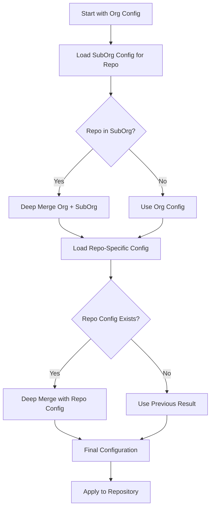

Safe Settings uses a three-tier hierarchical configuration system that allows you to define sensible defaults while providing flexibility for specific teams and repositories.

## Precedence Order

Settings are applied with the following precedence:

<Steps>
  <Step title="Repository Settings">
    Highest priority - Settings in `.github/repos/<repo-name>.yml` override all other levels
  </Step>
  
  <Step title="Sub-Organization Settings">
    Middle priority - Settings in `.github/suborgs/*.yml` override org-level defaults
  </Step>
  
  <Step title="Organization Settings">
    Lowest priority - Settings in `.github/settings.yml` provide the baseline defaults
  </Step>
</Steps>

<Note>
The precedence order is: **Repository > Sub-Organization > Organization**

As noted in the codebase: "The precedence order is repository > suborg > org (.github/repos/*.yml > .github/suborgs/*.yml > .github/settings.yml)"
</Note>

## How Configuration Merging Works

Safe Settings uses a deep merge algorithm implemented in `lib/mergeDeep.js`. Here's how it works:

### Deep Merge Algorithm



The merge algorithm follows these rules:

1. **Objects are merged recursively** - Nested settings are combined at every level
2. **Arrays are merged by name** - Array elements with the same `name` field are merged together
3. **Primitives are overwritten** - Simple values from higher precedence levels replace lower ones
4. **Null values are preserved** - Setting a value to `null` explicitly disables it

### Merge Example

Let's see how settings are merged for a repository called `api-gateway` that belongs to the `backend-team` suborg:

<CodeGroup>
```yaml Org Level (.github/settings.yml)
repository:
  private: true
  has_issues: true
  has_wiki: true
  has_projects: true

branches:
  - name: default
    protection:
      required_pull_request_reviews:
        required_approving_review_count: 1
        dismiss_stale_reviews: true
      enforce_admins: true

teams:
  - name: core
    permission: admin
```

```yaml SubOrg Level (.github/suborgs/backend-team.yml)
suborgrepos:
  - api-*
  - core-service

repository:
  has_wiki: false  # Backend repos don't use wikis

branches:
  - name: default
    protection:
      required_pull_request_reviews:
        required_approving_review_count: 2  # Backend needs 2 approvals
        require_code_owner_reviews: true

teams:
  - name: backend-team
    permission: push
```

```yaml Repo Level (.github/repos/api-gateway.yml)
repository:
  has_projects: false  # This specific repo doesn't use projects

branches:
  - name: default
    protection:
      required_pull_request_reviews:
        required_approving_review_count: 3  # Critical API needs 3 approvals
      required_status_checks:
        strict: true
        contexts:
          - "CI/test"
          - "security/scan"
```

```yaml Final Merged Configuration
repository:
  private: true              # From org level
  has_issues: true           # From org level
  has_wiki: false            # From suborg level (overridden)
  has_projects: false        # From repo level (overridden)

branches:
  - name: default
    protection:
      required_pull_request_reviews:
        required_approving_review_count: 3        # From repo level
        dismiss_stale_reviews: true               # From org level
        require_code_owner_reviews: true          # From suborg level
      enforce_admins: true                        # From org level
      required_status_checks:                     # From repo level
        strict: true
        contexts:
          - "CI/test"
          - "security/scan"

teams:
  - name: core           # From org level
    permission: admin
  - name: backend-team   # From suborg level (added)
    permission: push
```
</CodeGroup>

## Merge Behavior by Data Type

### Objects

Objects are merged recursively. Properties from higher precedence levels are merged into properties from lower levels.

```yaml
# Org Level
repository:
  private: true
  has_issues: true

# Repo Level
repository:
  has_issues: false  # This overrides
  has_wiki: true     # This is added

# Result
repository:
  private: true      # Kept from org level
  has_issues: false  # Overridden by repo level
  has_wiki: true     # Added from repo level
```

### Arrays

Arrays are merged by matching elements with the same identifying field (usually `name`, `username`, or `login`).

<Tabs>
  <Tab title="Named Arrays">
    Arrays with elements that have a `name` field are merged by name:
    
    ```yaml
    # Org Level
    teams:
      - name: core
        permission: admin
      - name: developers
        permission: push
    
    # SubOrg Level
    teams:
      - name: developers
        permission: pull  # This overrides the permission for 'developers'
      - name: backend
        permission: push  # This is added
    
    # Result
    teams:
      - name: core
        permission: admin
      - name: developers
        permission: pull   # Overridden
      - name: backend
        permission: push   # Added
    ```
  </Tab>
  
  <Tab title="Simple Arrays">
    Simple arrays (like topics) are concatenated:
    
    ```yaml
    # Org Level
    repository:
      topics:
        - github
        - automation
    
    # Repo Level
    repository:
      topics:
        - api
        - production
    
    # Result
    repository:
      topics:
        - github
        - automation
        - api
        - production
    ```
  </Tab>
</Tabs>

### Primitives

Primitive values (strings, numbers, booleans) from higher precedence levels completely replace values from lower levels.

```yaml
# Org Level
repository:
  default_branch: main

# Repo Level  
repository:
  default_branch: master  # This completely replaces the org value

# Result
repository:
  default_branch: master
```

## Configuration Loading Process

When Safe Settings processes a repository, it follows these steps:

<Steps>
  <Step title="Load Organization Config">
    Read `.github/settings.yml` from the admin repository. This provides the baseline configuration.
  </Step>
  
  <Step title="Check SubOrg Membership">
    Determine if the repository belongs to any sub-organization by:
    - Matching repository name against `suborgrepos` patterns
    - Checking if repository has teams listed in `suborgteams`
    - Checking if repository has custom properties matching `suborgproperties`
  </Step>
  
  <Step title="Load and Merge SubOrg Config">
    If the repository belongs to a suborg, load the suborg config and deep merge it with the org config.
  </Step>
  
  <Step title="Load and Merge Repo Config">
    Load `.github/repos/<repo-name>.yml` (if it exists) and deep merge it with the previous result.
  </Step>
  
  <Step title="Apply Final Configuration">
    The merged configuration is applied to the repository via GitHub API.
  </Step>
</Steps>

## Configuration Scope

Not all settings can be configured at all levels:

### Organization-Targeted Settings

Some settings only apply at the organization level:

- **Rulesets** with `repository_name` conditions (these apply to multiple repositories)

These settings are defined in `.github/settings.yml` and cannot be overridden at suborg or repo level.

### Repository-Targeted Settings

Most settings apply to individual repositories and can be configured at all three levels:

- Repository settings (visibility, features, etc.)
- Branch protection rules
- Teams and collaborators
- Labels and milestones
- Environments
- Custom properties
- And more...

<CodeGroup>
```yaml Org-Targeted (Rulesets only)
rulesets:
  - name: Security Requirements
    target: branch
    enforcement: active
    conditions:
      repository_name:
        include: ["prod-*", "api-*"]
    rules:
      - type: required_signatures
```

```yaml Repo-Targeted (Most settings)
repository:
  private: true
  has_issues: true

branches:
  - name: default
    protection:
      required_pull_request_reviews:
        required_approving_review_count: 2

teams:
  - name: developers
    permission: push
```
</CodeGroup>

## Validation and Override Rules

You can define custom validators in your deployment settings to control which overrides are allowed:

<Tabs>
  <Tab title="Override Validators">
    Prevent suborg or repo settings from weakening org-level security:
    
    ```yaml deployment-settings.yml
    overridevalidators:
      - plugin: branches
        error: |
          Branch protection required_approving_review_count cannot be overridden to a lower value
        script: |
          console.log(`baseConfig ${JSON.stringify(baseconfig)}`)  
          console.log(`overrideConfig ${JSON.stringify(overrideconfig)}`)
          if (baseconfig.protection.required_pull_request_reviews.required_approving_review_count && 
              overrideconfig.protection.required_pull_request_reviews.required_approving_review_count) {
            return overrideconfig.protection.required_pull_request_reviews.required_approving_review_count >= 
                   baseconfig.protection.required_pull_request_reviews.required_approving_review_count
          }
          return true
    ```
  </Tab>
  
  <Tab title="Config Validators">
    Enforce global rules on all configurations:
    
    ```yaml deployment-settings.yml
    configvalidators:
      - plugin: collaborators
        error: |
          Admin role cannot be assigned to collaborators
        script: |
          console.log(`baseConfig ${JSON.stringify(baseconfig)}`)
          return baseconfig.permission != 'admin'
    ```
  </Tab>
</Tabs>

## Preventing Configuration Drift

Safe Settings actively prevents configuration drift through webhook events:

- When settings are changed directly in GitHub UI, Safe Settings receives an event
- It compares the current settings with the configuration in the admin repo
- If differences are detected, it syncs the settings back to match the configuration
- This ensures your configuration files remain the source of truth

<Accordion title="How does Safe Settings detect changes?">
Safe Settings listens to webhook events like:
- `repository.edited` - When repository settings are changed
- `branch_protection_rule` - When branch protection is modified
- `repository_ruleset` - When rulesets are changed
- `member_change_events` - When team/collaborator access changes

When these events occur, Safe Settings compares the GitHub settings with your configuration and syncs them back if needed.
</Accordion>

<Accordion title="Can I temporarily bypass Safe Settings?">
No, Safe Settings is designed to enforce your policies consistently. However, you can:
- Update your configuration files and create a PR to make changes
- Define bypass actors in rulesets who can make emergency changes
- Temporarily disable Safe Settings if absolutely necessary (not recommended)
</Accordion>

<Accordion title="What happens during the sync process?">
Safe Settings uses an intelligent comparison algorithm that:
1. Fetches current settings from GitHub
2. Compares them with your configuration
3. Identifies additions, modifications, and deletions
4. Only makes API calls if there are actual changes
5. Creates a check run with the results

This ensures Safe Settings is efficient and doesn't make unnecessary API calls.
</Accordion>

## Next Steps

<CardGroup cols={2}>
  <Card title="Org Settings" icon="building" href="/configuration/org-settings">
    Configure organization-wide defaults
  </Card>
  
  <Card title="SubOrg Settings" icon="layer-group" href="/configuration/suborg-settings">
    Group repositories and apply team-specific policies
  </Card>
  
  <Card title="Repo Settings" icon="file-code" href="/configuration/repo-settings">
    Override settings for individual repositories
  </Card>
  
  <Card title="Deployment Settings" icon="gear" href="/configuration/deployment-settings">
    Configure validators and restrictions
  </Card>
</CardGroup>