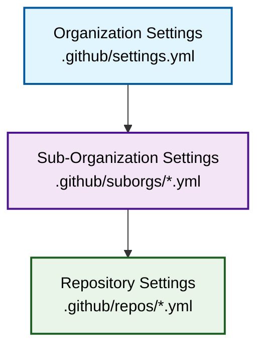

Safe Settings uses a powerful three-tier configuration hierarchy to manage repository settings, branch protections, teams, and more across your entire GitHub organization. All configuration files are stored centrally in an admin repository.

## Configuration Structure

All settings are stored in your admin repository (default: `admin`) under the `.github` directory:

```
admin/
├── .github/
│   ├── settings.yml          # Organization-wide settings
│   ├── suborgs/              # Sub-organization settings
│   │   ├── frontend-team.yml
│   │   └── backend-team.yml
│   └── repos/                # Repository-specific settings
│       ├── api-service.yml
│       └── web-app.yml
```

## Configuration Hierarchy

Settings are applied in a hierarchical manner with the following precedence:



**Precedence Order**: Repository > Sub-Organization > Organization

<Note>
Repo-level settings override suborg-level settings, which in turn override org-level settings. This allows you to set sensible defaults at the organization level while providing flexibility for specific teams or repositories.
</Note>

## How Configuration Merging Works

Safe Settings uses a deep merge algorithm to combine configurations across different levels:

1. **Start with org-level settings** - Base configuration from `.github/settings.yml`
2. **Overlay suborg settings** - If the repository belongs to a suborg, merge in suborg-specific settings
3. **Apply repo-specific settings** - Finally, apply any repository-specific overrides

For example:

<Tabs>
  <Tab title="Org Level">
    ```yaml .github/settings.yml
    repository:
      private: true
      has_issues: true
      has_wiki: true
    
    branches:
      - name: default
        protection:
          required_pull_request_reviews:
            required_approving_review_count: 1
    ```
  </Tab>
  <Tab title="SubOrg Level">
    ```yaml .github/suborgs/backend-team.yml
    suborgrepos:
      - api-*
      - core-service
    
    branches:
      - name: default
        protection:
          required_pull_request_reviews:
            required_approving_review_count: 2  # Override: backend needs 2 approvals
    ```
  </Tab>
  <Tab title="Repo Level">
    ```yaml .github/repos/api-gateway.yml
    repository:
      has_wiki: false  # Override: this specific repo doesn't need a wiki
    
    branches:
      - name: default
        protection:
          required_pull_request_reviews:
            required_approving_review_count: 3  # Override: critical repo needs 3 approvals
    ```
  </Tab>
  <Tab title="Final Result">
    For the `api-gateway` repository, the final merged configuration would be:
    
    ```yaml
    repository:
      private: true           # From org level
      has_issues: true        # From org level
      has_wiki: false         # From repo level (overridden)
    
    branches:
      - name: default
        protection:
          required_pull_request_reviews:
            required_approving_review_count: 3  # From repo level (overridden twice)
    ```
  </Tab>
</Tabs>

## Configurable Settings

Safe Settings allows you to configure the following aspects of your repositories:

<CardGroup cols={2}>
  <Card title="Repository Settings" icon="repo">
    - Visibility (public/private)
    - Description and homepage
    - Features (issues, projects, wiki)
    - Merge strategies
    - Auto-delete branches
  </Card>
  
  <Card title="Branch Protection" icon="shield">
    - Required reviews
    - Status checks
    - Linear history
    - Admin enforcement
    - Restrictions
  </Card>
  
  <Card title="Access Control" icon="users">
    - Team permissions
    - Collaborator access
    - Deploy keys
  </Card>
  
  <Card title="Repository Features" icon="puzzle-piece">
    - Labels
    - Milestones
    - Topics
    - Custom properties
    - Autolinks
  </Card>
  
  <Card title="Rulesets" icon="gavel">
    - Org-level rulesets
    - Repo-level rulesets
    - Tag protection
    - Branch patterns
  </Card>
  
  <Card title="Environments" icon="server">
    - Deployment environments
    - Environment variables
    - Protection rules
    - Required reviewers
  </Card>
</CardGroup>

## Configuration File Format

All configuration files use YAML format and follow the same structure. The specific settings available depend on the configuration level:

- **Org-level** (`.github/settings.yml`): Can configure both org-targeted settings (rulesets) and repo-targeted defaults
- **Suborg-level** (`.github/suborgs/*.yml`): Must define which repos belong to the suborg, then can override org settings
- **Repo-level** (`.github/repos/*.yml`): Can override any org or suborg settings for that specific repository

<Accordion title="Why store all settings in one repository?">
Unlike other repository settings apps, Safe Settings stores all configuration centrally in an admin repository. This provides several benefits:

- **Single source of truth** - All policies are in one place
- **Centralized access control** - Use CODEOWNERS to control who can approve policy changes
- **Audit trail** - All changes are tracked through Git history
- **PR workflow** - Changes are validated before being applied
- **Prevents configuration drift** - Settings can't be changed directly in individual repos
</Accordion>

<Accordion title="What happens when settings conflict?">
Safe Settings uses a clear precedence order: Repository > Sub-Organization > Organization.

When the same setting is defined at multiple levels, the most specific level wins. You can also define custom validators to prevent certain overrides (e.g., prevent reducing the number of required reviewers).
</Accordion>

<Accordion title="Can I customize the admin repository name?">
Yes! You can set the `ADMIN_REPO` environment variable to use a different repository name instead of `admin`. The `.github` directory can also be customized using `CONFIG_PATH`, and the org-level settings file can be changed with `SETTINGS_FILE_PATH`.
</Accordion>

## Next Steps

<CardGroup cols={2}>
  <Card title="Configuration Hierarchy" icon="sitemap" href="/configuration/hierarchy">
    Understand how settings are merged and applied
  </Card>
  
  <Card title="Org Settings" icon="building" href="/configuration/org-settings">
    Configure organization-wide defaults
  </Card>
  
  <Card title="SubOrg Settings" icon="layer-group" href="/configuration/suborg-settings">
    Create settings for groups of repositories
  </Card>
  
  <Card title="Repo Settings" icon="file-code" href="/configuration/repo-settings">
    Override settings for specific repositories
  </Card>
</CardGroup>