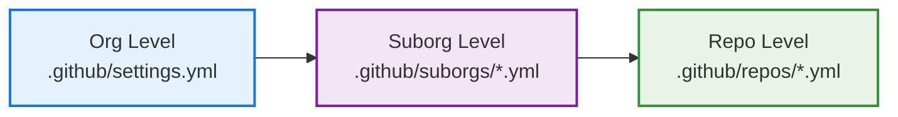

Safe Settings uses a three-level configuration hierarchy that allows you to set organization-wide defaults while giving teams flexibility to customize settings for their specific needs.

## Configuration Hierarchy



**Precedence Order**: Repository > Sub-Organization > Organization

Settings at lower levels override settings at higher levels, allowing centralized defaults with local customization.

## Basic Multi-Level Example

<CodeGroup>
```yaml .github/settings.yml
# Organization-level defaults
repository:
  private: true
  has_issues: true
  has_wiki: false
  allow_merge_commit: false
  allow_squash_merge: true
  delete_branch_on_merge: true

labels:
  include:
    - name: bug
      color: "d73a4a"
    - name: enhancement
      color: "a2eeef"

teams:
  - name: all-engineers
    permission: pull

branches:
  - name: default
    protection:
      required_pull_request_reviews:
        required_approving_review_count: 1
        dismiss_stale_reviews: true
      required_status_checks:
        strict: true
        contexts: []
      enforce_admins: false
      restrictions:
        apps: []
        users: []
        teams: []
```

```yaml .github/suborgs/backend-services.yml
# Suborg-level overrides for backend services
suborgrepos:
  - "api-*"
  - "service-*"
  - "backend-*"

# Add backend-specific labels
labels:
  include:
    - name: bug
      color: "d73a4a"
    - name: enhancement
      color: "a2eeef"
    - name: database
      color: "ffa500"
    - name: performance
      color: "00ff00"

# Give backend team admin access
teams:
  - name: all-engineers
    permission: pull
  - name: backend-team
    permission: admin

# Stricter branch protection
branches:
  - name: default
    protection:
      required_pull_request_reviews:
        required_approving_review_count: 2  # Override: 2 instead of 1
        dismiss_stale_reviews: true
        require_code_owner_reviews: true    # Added requirement
      required_status_checks:
        strict: true
        contexts:
          - "ci/tests"      # Added required checks
          - "ci/security"
      enforce_admins: false
      restrictions:
        apps: []
        users: []
        teams: []
```

```yaml .github/repos/api-gateway.yml
# Repository-level overrides for critical gateway
repository:
  description: "API Gateway - Critical Production Service"
  topics:
    - api
    - gateway
    - production
    - critical

# Maximum security
branches:
  - name: default
    protection:
      required_pull_request_reviews:
        required_approving_review_count: 3  # Override: 3 approvals
        dismiss_stale_reviews: true
        require_code_owner_reviews: true
        require_last_push_approval: true    # Added requirement
        dismissal_restrictions:              # Added restriction
          teams:
            - platform-leads
      required_status_checks:
        strict: true
        contexts:
          - "ci/tests"
          - "ci/security"
          - "ci/load-test"       # Added check
          - "ci/integration-test" # Added check
      enforce_admins: true                  # Override: enforce for admins
      restrictions:
        teams:
          - platform-leads     # Only platform leads can push
```
</CodeGroup>

**Result for `api-gateway` repository**:
- Private repository (from org)
- Has issues, no wiki (from org)
- Squash merge only (from org)
- Backend + performance + database labels (from suborg)
- Backend team has admin access (from suborg)
- **3 approvals required** (from repo)
- 4 CI checks required (2 from suborg + 2 from repo)
- Only platform leads can push (from repo)
- Enforced for admins (from repo)

## Real-World Scenarios

### Scenario 1: Tiered Security by Service Criticality

<Tabs>
  <Tab title="Org: Default Security">
    ```yaml .github/settings.yml
    # Baseline security for all repos
    repository:
      private: true
      security:
        enableVulnerabilityAlerts: true
        enableAutomatedSecurityFixes: true
    
    branches:
      - name: default
        protection:
          required_pull_request_reviews:
            required_approving_review_count: 1
            dismiss_stale_reviews: true
          required_status_checks:
            strict: true
            contexts:
              - "ci/tests"
          enforce_admins: false
          restrictions:
            apps: []
            users: []
            teams: []
    ```
  </Tab>
  
  <Tab title="Suborg: Production Services">
    ```yaml .github/suborgs/production-critical.yml
    # Higher security for production services
    suborgproperties:
      - criticality: high
    
    branches:
      - name: default
        protection:
          required_pull_request_reviews:
            required_approving_review_count: 2
            dismiss_stale_reviews: true
            require_code_owner_reviews: true
          required_status_checks:
            strict: true
            contexts:
              - "ci/tests"
              - "ci/security-scan"
              - "ci/compliance"
          enforce_admins: true
          restrictions:
            apps: []
            users: []
            teams: []
    ```
  </Tab>
  
  <Tab title="Repo: Payment Service">
    ```yaml .github/repos/payment-processor.yml
    # Maximum security for payment processing
    repository:
      topics:
        - payments
        - pci-compliant
        - critical
    
    branches:
      - name: default
        protection:
          required_pull_request_reviews:
            required_approving_review_count: 3
            dismiss_stale_reviews: true
            require_code_owner_reviews: true
            require_last_push_approval: true
            dismissal_restrictions:
              teams:
                - security-team
                - payment-leads
          required_status_checks:
            strict: true
            contexts:
              - "ci/tests"
              - "ci/security-scan"
              - "ci/compliance"
              - "ci/pci-validation"
              - "ci/fraud-check"
          enforce_admins: true
          restrictions:
            teams:
              - payment-leads
    ```
  </Tab>
</Tabs>

### Scenario 2: Team-Based Configuration

<CodeGroup>
```yaml .github/settings.yml
# Minimal org defaults
repository:
  private: true
  has_issues: true
  default_branch: main

teams:
  - name: everyone
    permission: pull

labels:
  include:
    - name: bug
      color: "d73a4a"
    - name: enhancement
      color: "a2eeef"
```

```yaml .github/suborgs/frontend-team.yml
# Frontend team's repos
suborgteams:
  - frontend-team

repository:
  topics:
    - frontend
    - web

labels:
  include:
    - name: bug
      color: "d73a4a"
    - name: enhancement
      color: "a2eeef"
    - name: ui
      color: "fbca04"
    - name: a11y
      color: "c5def5"

teams:
  - name: everyone
    permission: pull
  - name: frontend-team
    permission: admin
  - name: design-team
    permission: push

branches:
  - name: default
    protection:
      required_pull_request_reviews:
        required_approving_review_count: 2
        dismiss_stale_reviews: true
      required_status_checks:
        strict: true
        contexts:
          - "ci/tests"
          - "ci/visual-regression"
      enforce_admins: false
      restrictions:
        apps: []
        users: []
        teams: []
```

```yaml .github/suborgs/backend-team.yml
# Backend team's repos
suborgteams:
  - backend-team

repository:
  topics:
    - backend
    - api

labels:
  include:
    - name: bug
      color: "d73a4a"
    - name: enhancement
      color: "a2eeef"
    - name: database
      color: "006b75"
    - name: api
      color: "0e8a16"

teams:
  - name: everyone
    permission: pull
  - name: backend-team
    permission: admin
  - name: dba-team
    permission: push

branches:
  - name: default
    protection:
      required_pull_request_reviews:
        required_approving_review_count: 2
        dismiss_stale_reviews: true
        require_code_owner_reviews: true
      required_status_checks:
        strict: true
        contexts:
          - "ci/tests"
          - "ci/integration-tests"
          - "ci/security"
      enforce_admins: false
      restrictions:
        apps: []
        users: []
        teams: []
```
</CodeGroup>

**Result**: Each team automatically gets their configuration applied to any repository they're added to, with team-specific labels, access, and protection rules.

### Scenario 3: Environment-Based Configuration

<CodeGroup>
```yaml .github/settings.yml
# Base settings
repository:
  private: true
  has_issues: true
  allow_squash_merge: true
  delete_branch_on_merge: true

teams:
  - name: engineering
    permission: push
```

```yaml .github/suborgs/staging-envs.yml
# Staging environments - relaxed rules
suborgrepos:
  - "*-staging"
  - "*-stg"
  - "staging-*"

repository:
  topics:
    - staging
    - non-production

branches:
  - name: default
    protection:
      required_pull_request_reviews:
        required_approving_review_count: 1
        dismiss_stale_reviews: false
      required_status_checks:
        strict: false
        contexts: []
      enforce_admins: false
      restrictions:
        apps: []
        users: []
        teams: []
```

```yaml .github/suborgs/production-envs.yml
# Production environments - strict rules
suborgrepos:
  - "*-production"
  - "*-prod"
  - "prod-*"

repository:
  topics:
    - production
    - critical

teams:
  - name: engineering
    permission: pull  # Engineers can only read prod repos
  - name: sre-team
    permission: admin  # SRE manages production

branches:
  - name: default
    protection:
      required_pull_request_reviews:
        required_approving_review_count: 2
        dismiss_stale_reviews: true
        require_code_owner_reviews: true
        require_last_push_approval: true
      required_status_checks:
        strict: true
        contexts:
          - "ci/tests"
          - "ci/security"
          - "ci/smoke-test"
      enforce_admins: true
      restrictions:
        teams:
          - sre-team
```
</CodeGroup>

**Result**: Repositories are automatically configured based on their environment (staging vs production) through naming conventions.

## Understanding Setting Merges

### How Arrays Merge

<Tabs>
  <Tab title="Labels">
    **Labels are merged** - items from all levels are combined:
    
    ```yaml
    # Org: 2 labels
    labels:
      include:
        - name: bug
        - name: enhancement
    
    # Suborg: adds 2 more
    labels:
      include:
        - name: bug        # same as org
        - name: enhancement  # same as org
        - name: frontend   # new
        - name: ui         # new
    
    # Result: 4 labels (bug, enhancement, frontend, ui)
    ```
  </Tab>
  
  <Tab title="Teams">
    **Teams are replaced** - lower level completely overrides:
    
    ```yaml
    # Org: 1 team
    teams:
      - name: everyone
        permission: pull
    
    # Suborg: replaces completely
    teams:
      - name: backend-team
        permission: admin
    
    # Result: Only backend-team
    # (everyone is NOT included unless explicitly added)
    ```
    
    To keep org teams, re-specify them:
    ```yaml
    teams:
      - name: everyone      # Re-specify from org
        permission: pull
      - name: backend-team  # Add new team
        permission: admin
    ```
  </Tab>
  
  <Tab title="Branch Protection">
    **Branch protection is replaced** - lower level overrides:
    
    ```yaml
    # Org: 1 approval
    branches:
      - name: default
        protection:
          required_pull_request_reviews:
            required_approving_review_count: 1
    
    # Suborg: changes to 2 approvals
    branches:
      - name: default
        protection:
          required_pull_request_reviews:
            required_approving_review_count: 2
    
    # Result: 2 approvals (suborg value)
    ```
  </Tab>
</Tabs>

### Complete Override vs. Partial Override

<Accordion title="Complete Override - Repository Settings">
  ```yaml
  # Org level
  repository:
    private: true
    has_issues: true
    has_wiki: false
  
  # Repo level - partial override
  repository:
    has_wiki: true  # Only override this field
  
  # Result:
  # private: true      (from org)
  # has_issues: true   (from org)
  # has_wiki: true     (from repo)
  ```
  
  Repository settings merge field-by-field.
</Accordion>

<Accordion title="Complete Override - Branch Protection">
  ```yaml
  # Org level
  branches:
    - name: default
      protection:
        required_pull_request_reviews:
          required_approving_review_count: 1
        required_status_checks:
          strict: true
          contexts: []
  
  # Repo level - must specify all fields
  branches:
    - name: default
      protection:
        required_pull_request_reviews:
          required_approving_review_count: 2
        required_status_checks:
          strict: true
          contexts:
            - "ci/tests"
        enforce_admins: true
        restrictions:
          apps: []
          users: []
          teams: []
  
  # Result: Exactly what's in repo level
  ```
  
  Branch protection replaces entirely - must specify all required fields.
</Accordion>

## Advanced Patterns

### Pattern 1: Shared Configuration Modules

Create suborg configs for common patterns:

```yaml
# .github/suborgs/public-repos.yml
# Use for all public/open-source repos
suborgrepos:
  - "docs-*"
  - "blog-*"
  - "examples-*"

repository:
  private: false
  visibility: public
  has_issues: true
  has_wiki: true
  license_template: mit

labels:
  include:
    - name: good first issue
    - name: help wanted
```

### Pattern 2: Property-Based Suborgs

```yaml
# .github/suborgs/high-security.yml
# Apply to repos with custom property
suborgproperties:
  - security-level: high

branches:
  - name: default
    protection:
      required_pull_request_reviews:
        required_approving_review_count: 3
      enforce_admins: true
```

Then set custom properties on repositories:
```yaml
# .github/repos/auth-service.yml
custom_properties:
  - name: security-level
    value: high
```

### Pattern 3: Milestone and Autolink Inheritance

```yaml
# Org level - shared milestones
milestones:
  - title: Q1 2024
    description: First quarter deliverables
    state: open
  - title: Q2 2024
    description: Second quarter deliverables
    state: open

autolinks:
  - key_prefix: "JIRA-"
    url_template: "https://jira.company.com/browse/JIRA-<num>"

# Suborg level - additional milestones
milestones:
  - title: Q1 2024
    description: First quarter deliverables
    state: open
  - title: Q2 2024
    description: Second quarter deliverables
    state: open
  - title: Backend Migration
    description: Database migration project
    state: open

autolinks:
  - key_prefix: "JIRA-"
    url_template: "https://jira.company.com/browse/JIRA-<num>"
  - key_prefix: "DB-"
    url_template: "https://dbissues.company.com/ticket/<num>"
```

## Best Practices

<CardGroup cols={2}>
  <Card title="Start Simple" icon="seedling">
    Begin with org-level settings only. Add suborg/repo configs when you have a clear need.
  </Card>
  
  <Card title="Document Overrides" icon="file-lines">
    Use comments to explain why settings are overridden:
    ```yaml
    # Override: Payment service requires PCI compliance
    branches:
      - name: default
        protection:
          required_approving_review_count: 3
    ```
  </Card>
  
  <Card title="Use CODEOWNERS" icon="users">
    Let different teams manage their suborg configs:
    ```
    .github/suborgs/frontend-*.yml @frontend-team
    .github/suborgs/backend-*.yml  @backend-team
    ```
  </Card>
  
  <Card title="Validate in PRs" icon="code-pull-request">
    Always test multi-level config changes in a PR first. Safe Settings will show you the merged result.
  </Card>
</CardGroup>

## Common Pitfalls

<Warning>
  **Teams Don't Merge**: If you specify teams at the suborg level, you must re-include org-level teams if you want to keep them.
</Warning>

<Warning>
  **Branch Protection Requires All Fields**: When overriding branch protection, you must specify all required fields (`required_pull_request_reviews`, `required_status_checks`, `enforce_admins`, `restrictions`).
</Warning>

<Warning>
  **Include/Exclude Patterns**: Be careful with overlapping patterns. Test your glob patterns to ensure repos match the intended suborg.
</Warning>

## Troubleshooting

<AccordionGroup>
  <Accordion title="Settings not applying as expected">
    **Debug steps**:
    1. Check which suborg config applies (review `suborgrepos`, `suborgteams`, `suborgproperties`)
    2. Check precedence: repo > suborg > org
    3. Review Safe Settings check run for what was actually applied
    4. Look for validation errors in PR comments
  </Accordion>
  
  <Accordion title="Repo matches multiple suborg configs">
    **Solution**: Only one suborg config applies per repository. If a repo matches multiple patterns:
    - First match wins (alphabetical order of filename)
    - Avoid overlapping suborg patterns
    - Use repo-level config for specific overrides
  </Accordion>
  
  <Accordion title="Changes not visible on some repos">
    **Check**:
    - Repository is not in `restrictedRepos`
    - Safe Settings has been triggered (push to default branch or webhook event)
    - No validation errors in check runs
  </Accordion>
</AccordionGroup>

## Next Steps

<CardGroup cols={2}>
  <Card title="Custom Validation" icon="check-circle" href="/examples/custom-validation">
    Add validators to prevent invalid overrides
  </Card>
  
  <Card title="Basic Setup" icon="rocket" href="/examples/basic-setup">
    Review the basic setup guide
  </Card>
</CardGroup>