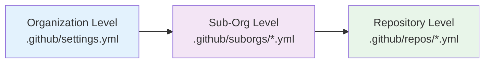

This section provides practical, production-ready configuration examples for Safe Settings. Each example is based on real-world use cases and demonstrates best practices for managing GitHub repository settings as code.

## Example Categories

### Getting Started

<Card title="Basic Setup" icon="rocket" href="/examples/basic-setup">
  Complete starter configuration for a new organization with sensible defaults
</Card>

### Core Features

<CardGroup cols={2}>
  <Card title="Branch Protection" icon="shield" href="/examples/branch-protection">
    Examples of branch protection rules with different security requirements
  </Card>
  
  <Card title="Team Management" icon="users" href="/examples/team-management">
    Team permissions with include/exclude patterns for flexible access control
  </Card>
</CardGroup>

### Advanced Patterns

<CardGroup cols={2}>
  <Card title="Multi-Level Config" icon="layer-group" href="/examples/multi-level-config">
    How org, suborg, and repo configurations merge together
  </Card>
  
  <Card title="Custom Validation" icon="check-circle" href="/examples/custom-validation">
    Real examples of configvalidators and overridevalidators
  </Card>
</CardGroup>

## Understanding the Configuration Hierarchy

Safe Settings uses a three-level configuration hierarchy:



**Precedence**: Repository > Sub-Organization > Organization

Settings at lower levels override settings at higher levels, allowing you to:
- Set organization-wide defaults
- Customize settings for groups of repositories (suborgs)
- Override specific settings for individual repositories

## Common Use Cases

### Enforce Security Standards
Set minimum security requirements at the org level (required approvals, status checks) while allowing teams to add stricter controls.

### Manage Team Permissions
Define team access patterns that automatically apply to repositories based on naming conventions or team membership.

### Prevent Configuration Drift
Ensure repository settings stay consistent with policy, even if someone manually changes them through the GitHub UI.

### Scale Policy Management
Manage thousands of repositories with a small set of configuration files instead of manually configuring each one.

## File Structure Example

```
admin/
├── .github/
│   ├── settings.yml              # Org-wide defaults
│   ├── suborgs/
│   │   ├── frontend-team.yml     # Frontend repo settings
│   │   ├── backend-team.yml      # Backend repo settings
│   │   └── security-critical.yml # High-security repos
│   └── repos/
│       ├── api-service.yml       # Specific repo overrides
│       └── public-docs.yml       # Public repo settings
└── deployment-settings.yml        # Runtime config & validators
```

## Next Steps

<Steps>
  <Step title="Start with Basic Setup">
    Begin with the [Basic Setup](/examples/basic-setup) example to create your first organization-wide configuration.
  </Step>
  
  <Step title="Add Branch Protection">
    Secure your codebase with [Branch Protection](/examples/branch-protection) rules.
  </Step>
  
  <Step title="Configure Team Access">
    Set up [Team Management](/examples/team-management) with pattern-based access control.
  </Step>
  
  <Step title="Scale with Multi-Level Configs">
    Learn [Multi-Level Configuration](/examples/multi-level-config) for complex organizations.
  </Step>
  
  <Step title="Add Custom Validation">
    Implement [Custom Validation](/examples/custom-validation) rules for your specific policies.
  </Step>
</Steps>

## Tips for Success

<AccordionGroup>
  <Accordion title="Start Simple">
    Begin with org-level settings and only add suborg/repo overrides when needed.
  </Accordion>
  
  <Accordion title="Use CODEOWNERS">
    Set up CODEOWNERS in your admin repo so different teams can manage their suborg configs.
  </Accordion>
  
  <Accordion title="Test in Dry-Run">
    Always test changes in a pull request first - Safe Settings will validate in dry-run mode.
  </Accordion>
  
  <Accordion title="Monitor Check Runs">
    Watch the safe-settings check runs to see what changes are being applied.
  </Accordion>
</AccordionGroup>