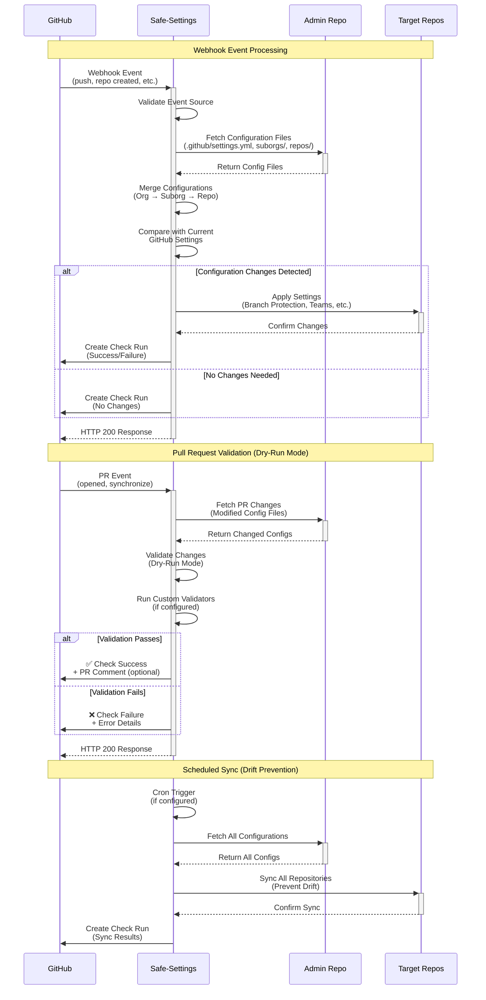
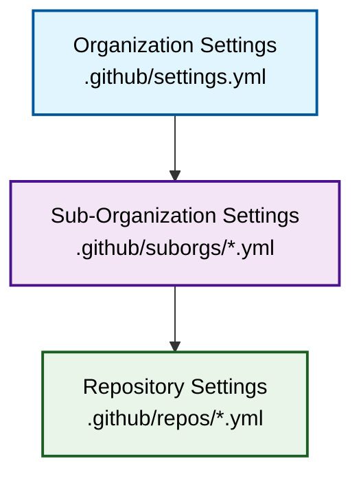

# How Safe Settings works

Safe Settings is a GitHub App built on the [Probot](https://probot.github.io/) framework that enforces repository settings as code. This guide explains the internal architecture, webhook processing, and configuration management.

## Architecture overview

Safe Settings operates as a webhook-driven application with optional scheduled execution:



## Core components

### 1. Webhook listener (index.js)

The main application file (`index.js`) registers webhook event handlers:

```javascript
// Repository created - apply settings to new repo
robot.on('repository.created', async context => {
  return syncSettings(false, context)
})

// Push to admin repo - sync settings
robot.on('push', async context => {
  const { payload } = context
  const adminRepo = repository.name === env.ADMIN_REPO
  const defaultBranch = payload.ref === 'refs/heads/' + repository.default_branch
  
  if (adminRepo && defaultBranch) {
    const settingsModified = payload.commits.find(commit => {
      return commit.added.includes(Settings.FILE_PATH) ||
             commit.modified.includes(Settings.FILE_PATH)
    })
    
    if (settingsModified) {
      return syncAllSettings(false, context)
    }
  }
})

// Branch protection modified by human - revert changes
robot.on('branch_protection_rule', async context => {
  const { sender } = context.payload
  if (sender.type !== 'Bot') {
    return syncSettings(false, context)
  }
})
```

### 2. Settings manager (lib/settings.js)

The `Settings` class orchestrates configuration loading, merging, and application:

```javascript
class Settings {
  static async syncAll(nop, context, repo, config, ref) {
    const settings = new Settings(nop, context, repo, config, ref)
    await settings.loadConfigs()
    await settings.updateOrg()      // Apply org-level rulesets
    await settings.updateAll()      // Apply to all repositories
    await settings.handleResults()  // Create check runs
    return settings
  }
  
  async updateRepos(repo) {
    // 1. Load org-level config
    let repoConfig = this.config.repository
    
    // 2. Merge suborg config
    const subOrgConfig = this.getSubOrgConfig(repo.repo)
    if (subOrgConfig?.repository) {
      repoConfig = this.mergeDeep.mergeDeep({}, repoConfig, subOrgConfig.repository)
    }
    
    // 3. Merge repo-specific config
    const overrideConfig = this.repoConfigs[`${repo.repo}.yml`]?.repository
    if (overrideConfig) {
      repoConfig = this.mergeDeep.mergeDeep({}, repoConfig, overrideConfig)
    }
    
    // 4. Apply merged configuration
    await this.applyConfiguration(repo, repoConfig)
  }
}
```

### 3. Plugin system

Each setting type is managed by a dedicated plugin:

```javascript
Settings.PLUGINS = {
  repository: require('./plugins/repository'),
  labels: require('./plugins/labels'),
  collaborators: require('./plugins/collaborators'),
  teams: require('./plugins/teams'),
  milestones: require('./plugins/milestones'),
  branches: require('./plugins/branches'),
  autolinks: require('./plugins/autolinks'),
  validator: require('./plugins/validator'),
  rulesets: require('./plugins/rulesets'),
  environments: require('./plugins/environments'),
  custom_properties: require('./plugins/custom_properties'),
  variables: require('./plugins/variables')
}
```

Each plugin:
1. Fetches current GitHub settings
2. Compares with desired configuration
3. Calculates additions, modifications, and deletions
4. Applies changes via GitHub API
5. Returns results for reporting

## Webhook events

Safe Settings responds to the following webhook events:

### Configuration change events

<AccordionGroup>
  <Accordion title="push - Configuration updates" icon="code-commit">
    **When**: Push to default branch of admin repository
    
    **Behavior**:
    - If `.github/settings.yml` modified → sync all repositories
    - If `.github/repos/*.yml` modified → sync specific repositories
    - If `.github/suborgs/*.yml` modified → sync suborg repositories
    - Ignores non-default branches (validated in dry-run mode)
    
    **Example**: Updating branch protection rules for all repositories
  </Accordion>
  
  <Accordion title="repository.created - New repository" icon="plus">
    **When**: New repository created in the organization
    
    **Behavior**:
    - Loads org-level settings
    - Checks for suborg membership (by name pattern, team, or properties)
    - Checks for repo-specific config file
    - Applies merged configuration
    
    **Example**: Automatically applying standard labels and branch protection to new repos
  </Accordion>
</AccordionGroup>

### Drift prevention events

<AccordionGroup>
  <Accordion title="branch_protection_rule - Protection modified" icon="shield">
    **When**: Branch protection rule modified or deleted via UI
    
    **Behavior**:
    - Ignores changes made by bots (including Safe Settings)
    - Reverts changes made by humans
    - Re-applies settings from admin repository
    
    **Example**: Admin manually disables required reviews → Safe Settings reverts
  </Accordion>
  
  <Accordion title="repository.edited - Repository settings changed" icon="pen">
    **When**: Repository settings modified (description, topics, features)
    
    **Behavior**:
    - Ignores bot changes
    - Syncs settings for human changes
    - Handles default branch renames
    
    **Example**: User changes repository visibility → Safe Settings may revert based on config
  </Accordion>
  
  <Accordion title="repository.renamed - Repository renamed" icon="i-cursor">
    **When**: Repository name changed
    
    **Behavior** (if `BLOCK_REPO_RENAME_BY_HUMAN=true`):
    - If renamed by human → reverts to original name
    - If renamed by bot → copies config file to new name
    - Safe Settings can rename repos by renaming the `.yml` config file
    
    **Example**: Standardizing repository naming conventions
  </Accordion>
  
  <Accordion title="repository_ruleset - Rulesets modified" icon="gavel">
    **When**: Repository or organization ruleset modified
    
    **Behavior**:
    - Org-level rulesets → syncs all repositories
    - Repo-level rulesets → syncs specific repository
    - Ignores bot changes
    
    **Example**: Admin weakens ruleset enforcement → Safe Settings reverts
  </Accordion>
  
  <Accordion title="member_change_events - Access modified" icon="users">
    **When**: Member, team, or collaborator access changed
    
    **Events**: `member`, `team.added_to_repository`, `team.removed_from_repository`, `team.edited`
    
    **Behavior**:
    - Ignores bot changes
    - Syncs teams and collaborators for human changes
    
    **Example**: User grants admin access manually → Safe Settings reverts to configured permission
  </Accordion>
  
  <Accordion title="custom_property_values - Properties updated" icon="tag">
    **When**: Custom property values set on repository
    
    **Behavior**:
    - Checks if property defines suborg membership
    - Applies appropriate suborg configuration
    
    **Example**: Setting `team: frontend` property applies frontend-team suborg config
  </Accordion>
</AccordionGroup>

### Pull request validation events

<AccordionGroup>
  <Accordion title="pull_request.opened/reopened - PR created" icon="code-pull-request">
    **When**: Pull request opened or reopened in admin repository
    
    **Behavior**:
    - Runs Safe Settings in **nop (no-operation) mode**
    - Validates configuration changes
    - Runs custom validators
    - Creates check run with dry-run results
    - Posts comment with change summary (if `ENABLE_PR_COMMENT=true`)
    
    **Example**: Preview what will change when PR is merged
  </Accordion>
  
  <Accordion title="check_run.created - Validation triggered" icon="check">
    **When**: Check run created for pull request
    
    **Behavior**:
    - Identifies changed configuration files
    - Runs validation in dry-run mode
    - Updates check run with results
    - Shows errors without applying changes
    
    **Example**: Validation catches custom validator violation before merge
  </Accordion>
</AccordionGroup>

## Configuration hierarchy

Safe Settings uses a three-tier hierarchy with intelligent merging:



### Configuration resolution

When applying settings to a repository:

1. **Load organization config** (`.github/settings.yml`)
   ```yaml
   repository:
     private: true
     has_issues: true
   branches:
     - name: default
       protection:
         required_pull_request_reviews:
           required_approving_review_count: 1
   ```

2. **Check suborg membership**
   
   Repositories can belong to suborgs via:
   
   **Name patterns**:
   ```yaml
   # .github/suborgs/frontend-team.yml
   suborgrepos:
     - frontend-*
     - web-app
   ```
   
   **Team membership**:
   ```yaml
   # .github/suborgs/backend-team.yml
   suborgteams:
     - backend-developers
   ```
   
   **Custom properties**:
   ```yaml
   # .github/suborgs/production.yml
   suborgproperties:
     - environment: production
   ```

3. **Merge suborg config** (if repository matches)
   ```yaml
   # Merged: org + suborg
   repository:
     private: true
     has_issues: true
     topics: [frontend, javascript]  # Added by suborg
   branches:
     - name: default
       protection:
         required_pull_request_reviews:
           required_approving_review_count: 2  # Overridden by suborg
   ```

4. **Merge repo-specific config** (if exists)
   ```yaml
   # Final merged config: org + suborg + repo
   repository:
     private: true
     has_issues: true
     topics: [frontend, javascript, react]  # Added by repo
   branches:
     - name: default
       protection:
         required_pull_request_reviews:
           required_approving_review_count: 3  # Overridden by repo
   ```

<Note>
**Deep merging**: Safe Settings performs deep merging of objects and arrays. More specific configurations override broader ones at every level of nesting.
</Note>

### Suborg configuration methods

<Tabs>
  <Tab title="Name Patterns">
    Match repositories by name using glob patterns:
    
    ```yaml
    suborgrepos:
      - api-*          # Matches api-users, api-auth, etc.
      - frontend-app
      - frontend-web
      - core-service
    ```
    
    **Use case**: Organizing repositories by functional area or team
  </Tab>
  
  <Tab title="Team Membership">
    Match repositories accessible to specific teams:
    
    ```yaml
    suborgteams:
      - frontend-developers
      - design-team
    ```
    
    **Use case**: Different policies for different teams
  </Tab>
  
  <Tab title="Custom Properties">
    Match repositories with specific property values:
    
    ```yaml
    suborgproperties:
      - environment: production
      - compliance: sox
    ```
    
    **Use case**: Stricter policies for production or regulated repositories
  </Tab>
</Tabs>

## Request flow details

### Normal operation (push to default branch)

1. **Webhook received**: GitHub sends `push` event
2. **Event validation**: Check if admin repo and default branch
3. **File detection**: Identify which config files changed
4. **Scope determination**:
   - `.github/settings.yml` changed → sync all repos
   - `.github/suborgs/*.yml` changed → sync suborg repos
   - `.github/repos/*.yml` changed → sync specific repos
5. **Configuration loading**: Fetch relevant config files
6. **Repository iteration**: Process each affected repository
7. **Configuration merging**: Org → Suborg → Repo
8. **Change detection**: Compare with current GitHub settings
9. **API calls**: Apply only actual changes
10. **Check run creation**: Report success/failure

### Dry-run mode (pull request)

1. **Webhook received**: GitHub sends `pull_request.opened` event
2. **Check run creation**: Safe Settings creates pending check
3. **File detection**: Identify changed config files in PR
4. **Configuration loading**: Load configs from PR branch
5. **Validation**:
   - YAML syntax validation
   - Custom `configvalidators` execution
   - Custom `overridevalidators` execution
6. **Simulation**: Process settings without applying
7. **Change calculation**: Determine what would change
8. **Check run update**: Report validation results
9. **PR comment**: Post summary of changes (optional)

<Warning>
Dry-run mode runs on non-default branches. Settings are **not applied** until merged to the default branch.
</Warning>

## Performance optimizations

When managing thousands of repositories, Safe Settings implements several optimizations:

### 1. Selective file loading

```javascript
// Only load relevant repo configs, not all files
if (settingsModified) {
  // Global change - load all configs
  await loadAllRepoConfigs()
} else if (suborgModified) {
  // Load only suborg member configs
  await loadSuborgRepoConfigs(suborgName)
} else if (repoModified) {
  // Load single repo config
  await loadRepoConfig(repoName)
}
```

### 2. Change detection

Before making API calls, Safe Settings compares desired vs. current state:

```javascript
// Calculate differences
const changes = {
  additions: {},      // New settings
  modifications: {},  // Changed settings
  deletions: {},      // Removed settings
  hasChanges: false
}

// Only call API if changes detected
if (changes.hasChanges) {
  await github.repos.update(settings)
}
```

Example change detection output:
```json
{
  "modifications": {
    "branches": [
      {
        "protection": {
          "required_pull_request_reviews": {
            "dismiss_stale_reviews": false
          }
        },
        "name": "master"
      }
    ]
  },
  "hasChanges": true
}
```

### 3. Rate limit handling

Probot automatically handles GitHub rate limits:
- Respects `X-RateLimit-Remaining` headers
- Implements exponential backoff
- Queues requests when limits approached

### 4. Caching

Safe Settings caches configuration files with ETags:

```javascript
if (Settings.fileCache[filepath]) {
  params.headers = {
    'If-None-Match': Settings.fileCache[filepath].etag
  }
}
```

## Custom validators

Safe Settings supports two types of custom validators:

### Config validators

Validate settings independently:

```yaml
configvalidators:
  - plugin: collaborators
    error: "Admin role cannot be assigned to collaborators"
    script: |
      console.log(`Validating: ${JSON.stringify(baseconfig)}`)
      return baseconfig.permission !== 'admin'
```

Access to:
- `baseconfig`: The setting being applied
- `githubContext`: Octokit instance for API calls

### Override validators

Validate overrides against base configuration:

```yaml
overridevalidators:
  - plugin: branches
    error: "Cannot reduce required approving review count"
    script: |
      if (baseconfig.protection?.required_pull_request_reviews?.required_approving_review_count &&
          overrideconfig.protection?.required_pull_request_reviews?.required_approving_review_count) {
        return overrideconfig.protection.required_pull_request_reviews.required_approving_review_count >=
               baseconfig.protection.required_pull_request_reviews.required_approving_review_count
      }
      return true
```

Access to:
- `baseconfig`: Base (org or suborg) configuration
- `overrideconfig`: Override (suborg or repo) configuration
- `githubContext`: Octokit instance for API calls

<Info>
Validators run during dry-run mode and can prevent invalid configurations from being merged.
</Info>

## Scheduled sync (drift prevention)

Configure periodic reconciliation to prevent drift:

```bash
# Run every hour
CRON="0 * * * *"

# Run every day at 2 AM
CRON="0 2 * * *"

# Run every 15 minutes
CRON="*/15 * * * *"
```

Scheduled sync:
1. Fetches all configuration files
2. Syncs all repositories
3. Reverts any manual changes
4. Creates check run with results

<Note>
Scheduled sync runs even if no webhooks were triggered, protecting against webhook delivery failures.
</Note>

## Restricted repositories

Control which repositories Safe Settings manages:

```yaml
restrictedRepos:
  exclude:
    - admin          # Configuration repository
    - .github        # GitHub metadata repository
    - safe-settings  # The app itself
    - test-*         # Temporary test repositories
  include:
    - prod-*         # Only production repositories
    - api-*          # Only API repositories
```

**Logic**:
- `exclude` only → Manage all except excluded
- `include` only → Manage only included
- Both → Manage included except excluded
- Neither → Exclude `admin`, `.github`, `safe-settings` by default

## Next steps

<CardGroup cols={2}>
  <Card title="Configuration Reference" icon="book" href="/configuration/overview">
    Explore all available settings and configuration options
  </Card>
  <Card title="Deployment Guide" icon="cloud" href="/deployment/overview">
    Learn about different deployment options and best practices
  </Card>
</CardGroup>
