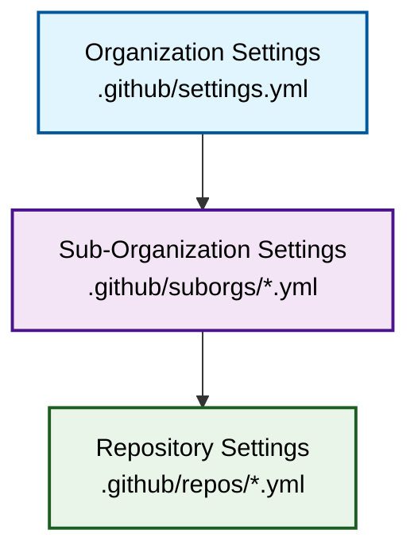

# Welcome to Safe Settings

Safe Settings is a GitHub App that enables **policy-as-code** management for your GitHub organization. Instead of manually configuring each repository, you define policies centrally and Safe Settings automatically applies them across your organization.

<CardGroup cols={2}>
  <Card title="Quick Start" icon="rocket" href="/quickstart">
    Get Safe Settings deployed and running in under 10 minutes
  </Card>
  <Card title="How It Works" icon="gears" href="/how-it-works">
    Understand the architecture, webhooks, and configuration hierarchy
  </Card>
  <Card title="Configuration Reference" icon="file-code" href="/configuration/overview">
    Comprehensive guide to all available settings and options
  </Card>
  <Card title="Deployment Options" icon="cloud" href="/deployment/overview">
    Deploy to AWS Lambda, Docker, Kubernetes, or GitHub Actions
  </Card>
</CardGroup>

## What is Safe Settings?

Safe Settings is a Probot-based GitHub App that enforces repository settings as code. All settings are stored in a central `admin` repository, and Safe Settings automatically syncs these configurations to your repositories when changes are detected.

### Key features

<CardGroup cols={3}>
  <Card title="Centralized Control" icon="building">
    Manage all repository settings from a single admin repository
  </Card>
  <Card title="Three-Tier Hierarchy" icon="layer-group">
    Organization → Sub-Organization → Repository level configurations
  </Card>
  <Card title="Drift Prevention" icon="shield">
    Automatically reverts unauthorized manual changes to settings
  </Card>
  <Card title="Pull Request Validation" icon="code-pull-request">
    Dry-run mode validates changes before applying them
  </Card>
  <Card title="Custom Validators" icon="check-circle">
    Define custom rules to enforce organizational policies
  </Card>
  <Card title="Scheduled Sync" icon="clock">
    Periodic reconciliation to prevent configuration drift
  </Card>
</CardGroup>

## What can you manage?

Safe Settings supports comprehensive repository and organization configuration:

### Repository settings
- **Basic settings**: Description, homepage, visibility, features (issues, projects, wikis)
- **Branch protections**: Required reviews, status checks, enforce admins
- **Repository rulesets**: Advanced branch and tag protection rules
- **Teams & collaborators**: Access permissions and restrictions
- **Issue labels & milestones**: Standardized labels across repositories
- **Custom properties**: Metadata for categorizing repositories
- **Environments**: Deployment protection rules, required reviewers
- **Autolinks**: Reference external resources automatically
- **Variables**: Repository and environment variables

### Organization settings
- **Organization rulesets**: Apply protection rules across multiple repositories
- **Custom properties**: Define organization-level metadata schemas

## Configuration hierarchy

Safe Settings uses a three-tier configuration hierarchy that allows you to define settings at different levels of granularity:



**Precedence order**: Repository > Sub-Organization > Organization

<Note>
Settings at more specific levels override settings from broader levels. For example, a repository-specific configuration overrides both sub-org and org-level settings.
</Note>

### Organization level (`.github/settings.yml`)

Define default settings applied to all repositories in your organization:

```yaml
repository:
  private: true
  has_issues: true
  default_branch: main
  delete_branch_on_merge: true

labels:
  - name: bug
    color: CC0000
    description: An issue with the system

branches:
  - name: default
    protection:
      required_pull_request_reviews:
        required_approving_review_count: 1
      enforce_admins: true
```

### Sub-organization level (`.github/suborgs/*.yml`)

Define settings for groups of repositories based on:
- **Repository name patterns**: `frontend-*`, `api-*`, `core-*`
- **Team membership**: Repositories accessible to specific teams
- **Custom properties**: Repositories with specific metadata values

```yaml
suborgrepos:
  - frontend-app
  - frontend-web
  - frontend-*

suborgteams:
  - frontend-team

repository:
  topics:
    - frontend
    - javascript

branches:
  - name: default
    protection:
      required_pull_request_reviews:
        required_approving_review_count: 2
```

### Repository level (`.github/repos/<repo-name>.yml`)

Define repository-specific overrides:

```yaml
repository:
  force_create: true
  template: template_repo
  description: API service for user authentication
  topics:
    - api
    - authentication
    - nodejs

branches:
  - name: default
    protection:
      required_pull_request_reviews:
        required_approving_review_count: 3
```

## Why use Safe Settings?

### Without Safe Settings
- Manual configuration of each repository
- Inconsistent settings across repositories
- No audit trail of changes
- Difficult to enforce organizational policies
- Manual drift detection and remediation
- Risk of unauthorized changes

### With Safe Settings
- Automated configuration management
- Consistent policies across all repositories
- Git-based audit trail with CODEOWNERS
- Automated policy enforcement
- Automatic drift prevention
- Pull request validation before changes
- Scheduled reconciliation

<Info>
Safe Settings is particularly valuable for organizations with:
- **Many repositories** (10+): Reduces manual configuration effort exponentially
- **Multiple teams**: Delegate policy management using CODEOWNERS
- **Compliance requirements**: Enforce security and governance policies automatically
- **High standards**: Prevent manual misconfigurations and drift
</Info>

## How it works (simplified)

1. **Configure**: Define settings in your admin repository's YAML files
2. **Commit**: Push changes to the default branch or create a pull request
3. **Validate**: Safe Settings runs in dry-run mode for pull requests
4. **Apply**: Settings are automatically applied when merged to default branch
5. **Protect**: Safe Settings prevents unauthorized manual changes via webhooks
6. **Reconcile**: Scheduled sync ensures configuration stays aligned

<CardGroup cols={2}>
  <Card title="Ready to get started?" icon="rocket" href="/quickstart">
    Follow the quickstart guide to deploy Safe Settings in your organization
  </Card>
  <Card title="Want to learn more?" icon="book" href="/how-it-works">
    Dive deeper into Safe Settings' architecture and capabilities
  </Card>
</CardGroup>

## Community and support

Safe Settings is open source and maintained by GitHub:

- **Repository**: [github/safe-settings](https://github.com/github/safe-settings)
- **License**: ISC
- **Built with**: [Probot](https://probot.github.io/) framework
- **Node.js**: Requires Node.js 18.0.0 or later (22.0.0+ recommended)
