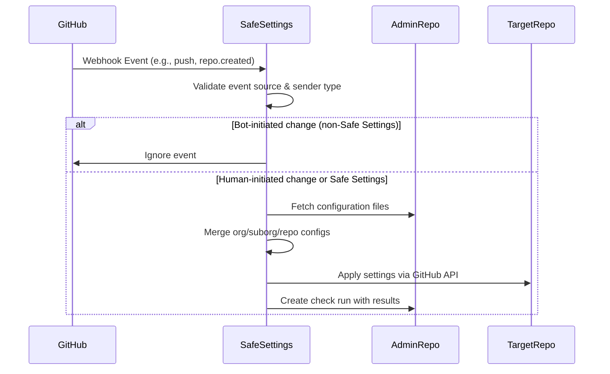

Safe Settings operates primarily through GitHub webhook events. When specific events occur in your organization, Safe Settings automatically applies the appropriate configuration settings to ensure your repositories remain in compliance with your policies.

## Webhook Event Handlers

Safe Settings listens to the following webhook events defined in `app.yml`:

- `branch_protection_rule`
- `check_run`
- `check_suite`
- `create`
- `custom_property_values`
- `member`
- `pull_request`
- `push`
- `repository`
- `repository_ruleset`
- `team`

## Event Triggers and Actions

### Push Event

**When it triggers:** When code is pushed to the default branch of the admin repository.

**What it does:**
- Detects changes to `.github/settings.yml`, `.github/repos/*.yml`, or `.github/suborgs/*.yml`
- If `.github/settings.yml` is modified, triggers a **full sync** across all repositories
- If specific repo or suborg configs are modified, syncs only those affected repositories
- Ignores pushes to non-default branches

**Source:** `index.js:250-288`

```javascript
robot.on('push', async context => {
  const adminRepo = repository.name === env.ADMIN_REPO
  const defaultBranch = payload.ref === 'refs/heads/' + repository.default_branch
  
  if (settingsModified) {
    return syncAllSettings(false, context)
  }
  
  if (repoChanges.length > 0 || subOrgChanges.length > 0) {
    return syncSelectedSettings(false, context, repoChanges, subOrgChanges)
  }
})
```

### Repository Created Event

**When it triggers:** When a new repository is created in the organization.

**What it does:**
- Automatically applies the appropriate settings to the new repository
- Combines org-level, suborg-level, and repo-specific configurations
- Ensures new repositories are immediately compliant with policies

**Source:** `index.js:615-620`

### Branch Protection Rule Event

**When it triggers:** When branch protection rules are created, edited, or deleted.

**What it does:**
- Checks if the change was made by a human user (not a bot)
- If modified by a human, syncs the repository to revert unauthorized changes
- Prevents manual circumvention of policy-defined branch protections

**Source:** `index.js:307-317`

```javascript
robot.on('branch_protection_rule', async context => {
  if (sender.type === 'Bot') {
    return // Ignore bot-initiated changes
  }
  return syncSettings(false, context)
})
```

### Repository Ruleset Event

**When it triggers:** When repository rulesets are modified.

**What it does:**
- Detects if the ruleset is organization-level or repository-level
- For org-level rulesets: triggers a full sync across all repositories
- For repo-level rulesets: syncs only the affected repository
- Ignores changes made by bots

**Source:** `index.js:331-350`

### Custom Property Values Event

**When it triggers:** When custom property values are updated on a repository.

**What it does:**
- Applies suborg configurations that are defined by custom properties
- Allows dynamic repository grouping based on property values
- Ignores changes made by bots

**Source:** `index.js:319-329`

### Member Change Events

**Event types:**
- `member` - Repository collaborators
- `team.added_to_repository`
- `team.removed_from_repository`
- `team.edited`

**When they trigger:** When repository access permissions are modified.

**What they do:**
- Sync repository settings to revert unauthorized permission changes
- Ensure team and collaborator access remains consistent with policy
- Only respond to human-initiated changes

**Source:** `index.js:352-369`

### Repository Edited Event

**When it triggers:** When repository settings are modified (description, homepage, topics, default branch, etc.).

**What it does:**
- Syncs the repository to restore policy-defined settings
- Prevents unauthorized changes to repository metadata
- Ignores bot-initiated changes

**Source:** `index.js:371-383`

### Repository Renamed Event

**When it triggers:** When a repository is renamed.

**What it does:**

By default, Safe Settings ignores repository renames. When `BLOCK_REPO_RENAME_BY_HUMAN=true`:

- **If renamed by a human:** Reverts the repository name to the original
- **If renamed by a bot (not Safe Settings):**
  - Attempts to copy `<old-repo>.yml` to `<new-repo>.yml` in the admin repo
  - Adds a comment indicating the rename occurred
  - Skips if `<new-repo>.yml` already exists
- **If renamed by Safe Settings:** Allows the rename (when renaming via config file)

**Source:** `index.js:385-461`

### Repository Archived/Unarchived Events

**When they trigger:** When a repository is archived or unarchived.

**What they do:**
- Sync repository settings to ensure archive state matches policy
- Ignore bot-initiated changes

**Source:** `index.js:622-646`

### Create Event

**When it triggers:** When a branch or tag is created.

**What it does:**
- Checks if the created branch is the default branch
- If yes, syncs repository settings
- Ignores branch creation by bots

**Source:** `index.js:290-305`

## Pull Request Validation Workflow

When configuration changes are proposed via pull request in the admin repository, Safe Settings runs in **dry-run mode** (NOP mode).

### PR Validation Events

- `pull_request.opened`
- `pull_request.reopened`
- `check_suite.requested`
- `check_suite.rerequested`
- `check_run.created`

**Source:** `index.js:491-613`

<Steps>

### PR is opened

Safe Settings creates a check run called "Safe-setting validator" for the PR.

### Check run is created

The app updates the check status to "in_progress" and analyzes the changed files.

### Configuration validation

- Identifies changed settings files (`.github/settings.yml`, repos, or suborgs)
- Runs Safe Settings in NOP mode with the PR branch ref
- Validates configuration syntax and custom validation rules
- Generates a report of what changes would be applied

### Check completion

The check run is updated with:
- **Success:** If all validations pass and configurations are valid
- **Failure:** If validation errors occur or custom rules are violated
- Detailed output showing additions, modifications, and deletions

### PR comment (optional)

If `ENABLE_PR_COMMENT=true`, a detailed comment is added to the PR with:
- Summary of affected repositories
- Changes grouped by plugin
- Error messages if validation fails

</Steps>

## Webhook Event Flow



## Bot Detection

Safe Settings includes logic to detect and ignore changes made by bots to prevent infinite loops:

```javascript
if (sender.type === 'Bot') {
  robot.log.debug('Change made by Bot')
  return
}
```

This ensures that when Safe Settings itself makes changes, it doesn't trigger additional sync operations.

## Webhook Configuration Requirements

To ensure Safe Settings receives all necessary events, your GitHub App must be configured with the following permissions in `app.yml`:

| Permission | Access Level | Purpose |
|------------|-------------|----------|
| `administration` | write | Manage repository settings |
| `checks` | write | Create check runs for validation |
| `contents` | write | Read config files and update repos |
| `members` | write | Manage team and collaborator access |
| `pull_requests` | write | Comment on PRs during validation |
| `organization_administration` | write | Manage org-level settings |
| `repository_custom_properties` | write | Read and write custom properties |

**Source:** `app.yml:33-116`